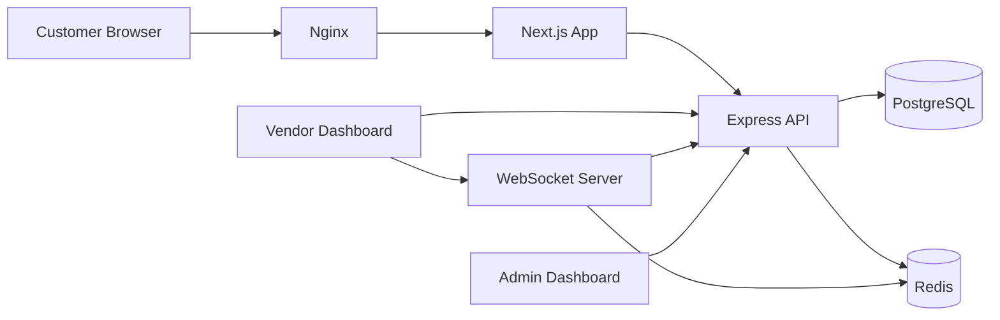

## Overview

Local food courts and multi-vendor dining spaces often manage orders through phone calls and paper tickets. This platform digitized the entire flow — customers browse menus from multiple vendors, place orders, and track preparation in real time. Vendors receive orders on a dashboard, update status, and manage their menu — all without a point-of-sale system.

## Problem

A local food court with 12 vendors processed orders manually: customers walked to each vendor, waited in line, and paid separately. During peak hours (12-2 PM), vendors were overwhelmed, customers waited 15-20 minutes per order, and the court lost potential revenue from customers who left due to long lines. There was no data on popular items, peak times, or order values — vendors operated blind.

## Requirements

- Multi-vendor catalog — each vendor manages their own menu, pricing, and availability
- Unified ordering — customer places one order across multiple vendors
- Real-time order flow — order placed → vendor notified → preparing → ready for pickup
- No payment integration in v1 — cash on pickup to keep scope manageable
- Vendor dashboard — incoming orders, status management, menu editor
- Admin dashboard — vendor onboarding, commission tracking, analytics
- Must work on mobile browsers — no native app requirement

## Constraints

- Solo developer with a 6-week delivery window to meet the court's peak season
- Vendors had varying technical comfort — interface had to be extremely simple
- No payment gateway integration meant orders were confirmed on trust (cash on pickup)
- The food court had unreliable WiFi — needed offline resilience in the vendor dashboard
- Zero budget for paid services — everything on a single VPS

## Architecture

### System Context



### Request Flow

1. Customer opens the menu page — a Next.js server-rendered page lists all vendors and their items grouped by category
2. Customer adds items from multiple vendors to a cart — cart is stored server-side in Redis with a 30-minute TTL
3. On order placement, the API creates an order record with vendor-specific sub-orders
4. Each vendor dashboard receives a real-time notification via WebSocket with a chime sound
5. Vendor accepts the order, prepares items, and marks each item as ready
6. Customer sees status updates on their order tracking page (no login required — just an order ID)
7. When all items from all vendors are marked ready, the customer is notified and picks up

### Database Design

```
vendors: {
  id, name, description, cuisine_type,
  is_active, opens_at, closes_at,
  created_at
}

menu_items: {
  id, vendor_id, name, description,
  price, category, is_available,
  preparation_time_minutes,
  image_url
}

orders: {
  id, customer_name, customer_phone,
  status: 'pending' | 'accepted' | 'preparing' | 'ready' | 'completed' | 'cancelled',
  total_amount, created_at
}

order_items: {
  id, order_id, vendor_id, menu_item_id,
  quantity, unit_price, status: 'pending' | 'preparing' | 'ready',
  notes
}
```

## Key Decisions

**Server-side cart in Redis**: Cart data stored in Redis with a TTL rather than in the database. This avoided abandoned cart cleanup logic and kept the database lean. The tradeoff was that customers lost their cart after 30 minutes of inactivity, which was acceptable for a food ordering context.

**WebSocket for vendor notifications**: Polling would have worked but introduced latency. WebSocket push meant vendors heard the chime and saw the order within seconds. Redis pub/sub bridged the Next.js app and the WS server so order creation events propagated reliably.

**No user accounts**: Customers ordered without registration — just a name and phone number. This removed auth complexity, reduced friction, and was appropriate for a food court where repeat customers are recognized by face. Order status was tracked via a short order ID displayed as a QR code on the confirmation page.

**Sub-order pattern**: A single customer order creates multiple vendor-specific sub-orders. This allowed each vendor to independently update their portion without conflicting. The master order status is computed from sub-order statuses (all ready → ready).

## Challenges

**Order consistency across vendors**: When a customer ordered from 3 vendors, all 3 needed to receive the order simultaneously. If one vendor dashboard was down, the order was partially delivered. We implemented a two-phase acknowledgment — the order is accepted only when all vendors acknowledge within 60 seconds. Otherwise, accepted portions are cancelled and the customer is notified.

**Offline resilience**: The food court WiFi was unreliable. The vendor dashboard cached active orders in localStorage and displayed them even when the WebSocket connection dropped. When connectivity returned, it replayed any status changes. This was the most user-appreciated feature — vendors never missed an order.

**Peak hour load**: During 12-2 PM, the system handled 60+ orders in 2 hours. The WebSocket server initially struggled with 20+ concurrent connections. Moving from a single process to clustering with Node.js worker threads resolved the issue.

## Outcome

- 12 vendors onboarded and actively using the platform for daily operations
- Order processing time reduced from 15-20 minutes to 5-8 minutes during peak hours
- Vendors gained visibility into their busiest times, popular items, and average order values — data they never had before
- The food court reported increased lunchtime traffic as customers appreciated the convenience

## Lessons Learned

1. **Simple beats scalable when starting**. No user accounts, no payments, no native apps. Every omitted feature saved development time and reduced complexity. The system worked because it solved the core problem: connecting customers to vendors digitally.

2. **Offline-first thinking builds trust**. The localStorage caching wasn't planned — it was a response to the WiFi issue. But it became the most reliable part of the system from the vendor perspective. Building for the worst network conditions from day one would have been even better.

3. **Two-phase confirmation prevents chaos**. The 60-second acknowledgment window prevented the worst failure mode: a customer arriving at a vendor who never received the order. This should have been in the initial design rather than added after a real incident.

## What I'd Do Differently Today

**Event-driven architecture**: The synchronous flow (order → notify → acknowledge → confirm) worked but was fragile. Today I'd use an event-driven model with a message broker (RabbitMQ or Redis Streams). Each vendor gets a dedicated queue; failures are isolated and retried independently.

**Payment integration from v1**: Cash on pickup was pragmatic, but it created reconciliation work for vendors. Integrating a payment gateway (even a simple one like Stripe) would have closed the loop and provided better data for the admin dashboard.

**Dedicated WebSocket service**: The WebSocket server was embedded in the Express process. A separate WS service with horizontal scaling would handle peak hours better and isolate failures.

**Proper testing**: The six-week timeline meant testing was manual. Critical paths (order placement → vendor notification → status updates) should have had integration tests. Refactoring was nerve-wracking without a safety net.

## Technical Debt & Limitations

- **No automated testing**: Manual testing only — every deploy was risky.
- **No payment integration**: Cash on pickup limited scalability and created manual reconciliation.
- **No analytics dashboard**: Vendors wanted historical data (busiest days, popular items, revenue trends). Basic analytics would have been the highest-value addition.
- **No customer accounts**: Order history was lost after pickup. Repeat customers had to enter their details each time.
- **No queue management**: During peak hours, all orders arrived simultaneously. A queue system with estimated wait times would have improved customer experience.
- **No mobile app**: Mobile browser worked but a lightweight PWA would have been better — push notifications for order status, offline menu browsing.
- **Single server deployment**: Everything on one VPS. Database backups were manual. A production deployment would require redundancy.
