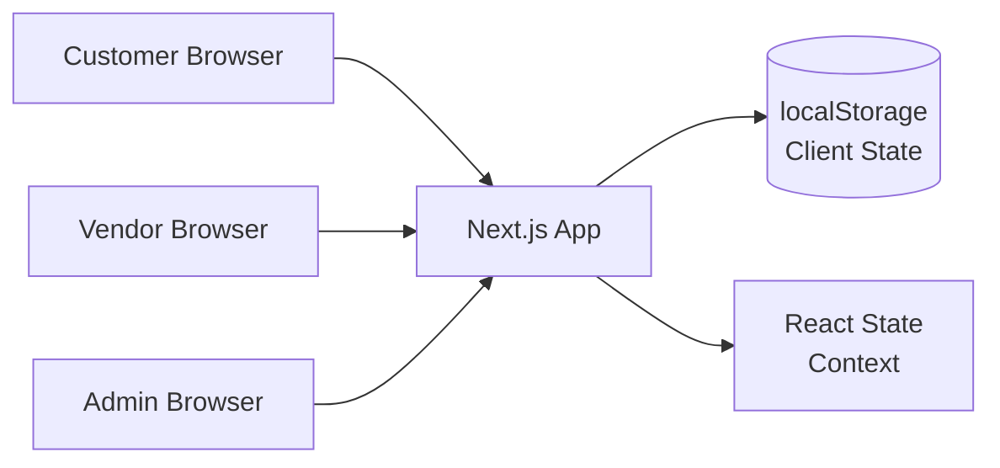

## Overview

A frontend-only multi-vendor food ordering interface designed for local food courts and multi-vendor dining spaces. The UI simulates the complete ordering flow — customers browse menus from multiple vendors, place orders, and track preparation in real time. Vendors receive orders on a dashboard view, update status, and manage their menu.

Built as a frontend-focused project to explore complex UI state management, real-time status progression, and responsive multi-view layouts. The backend integration is planned for a future iteration.

## Problem

Local food courts with multiple vendors process orders manually — customers walk to each vendor, wait in line, and pay separately. During peak hours, vendors are overwhelmed and customers wait 15-20 minutes per order. No digital interface exists to streamline the ordering flow or give vendors visibility into incoming orders.

This project explores what the UI layer of a solution would look like — designing for clarity, real-time feedback, and mobile-first usage across three distinct user perspectives: customer, vendor, and admin.

## Requirements

- Multi-vendor catalog — each vendor manages their own menu, pricing, and availability
- Unified ordering — customer places one order across multiple vendors
- Real-time order flow — order placed → vendor notified → preparing → ready for pickup
- Vendor dashboard view — incoming orders, status management, menu editor
- Admin dashboard view — vendor onboarding, analytics
- Mobile-first responsive design
- Three distinct interfaces: customer browsing, vendor operations, admin oversight

## Constraints

- Frontend-only — no backend API or database
- All data is managed through client-side state and localStorage
- Solo developer with a 6-week delivery window
- Must work on mobile browsers — no native app requirement
- No payment integration in this iteration

## Architecture

### System Context



### Component Architecture

```
App
├── Public Routes
│   ├── MenuPage          — vendor listing, item cards, filters
│   └── OrderTracking     — real-time status per sub-order
├── Vendor Routes
│   ├── VendorDashboard   — incoming orders, accept/reject
│   ├── OrderManagement   — status progression per item
│   └── MenuEditor        — item CRUD, pricing, availability
└── Admin Routes
    ├── AdminDashboard    — vendor onboarding, analytics
    └── VendorManagement  — vendor CRUD, commission settings
```

Each route is a self-contained page component with shared UI primitives (Card, Button, Badge, Table) and context providers for global state.

### State Management

```
CartContext  — multi-vendor cart with per-vendor item grouping
OrderContext — order creation, status progression, sub-order tracking
VendorContext — vendor profile, menu items, availability
UIContext   — active tab, sidebar, modal state
```

All context providers use React Context with useReducer for predictable state transitions. Persistent data (cart, active orders) is synced to localStorage for session continuity.

## Key Decisions

**Three-role view architecture**: Instead of a single dashboard with role-based feature toggles, designed separate route groups for customers, vendors, and admin. Each view has its own layout, navigation, and component tree. This made the codebase easier to reason about at the cost of some shared layout duplication.

**Context + useReducer over Zustand/Redux**: For the data volume of a food court (12 vendors, ~100 menu items, ~100 orders/day), React Context with useReducer provided sufficient state management without adding a dependency. The predictable reducer pattern made state transitions debuggable and testable.

**localStorage for offline resilience**: The vendor dashboard caches active orders in localStorage and displays them even when the network drops. When connectivity returns, pending status changes are replayed. This was inspired by real-world unreliable WiFi in food courts.

**No user accounts**: Customers order without registration — just a name and phone number. This removed auth UI complexity and reduced friction. Order status is tracked via a short order ID displayed as a QR code on the confirmation page.

## Challenges

**Multi-vendor cart state**: A single order can include items from 3+ vendors, each with independent preparation times and statuses. The cart context needed to group items by vendor, compute per-vendor subtotals, and track per-vendor order status independently. The sub-order pattern emerged from this — each vendor's portion is a separate state machine.

**Real-time UI without a backend**: Simulating real-time order progression without WebSocket or a backend required a creative approach. Order statuses advance via a simulated event queue with configurable delays — mimicking vendor acceptance, preparation, and completion. The UI renders status updates as if they arrived from a server, making the frontend ready for a real backend integration.

**Responsive vendor dashboard**: The vendor view needed to show incoming orders, active preparations, and completed items on a single screen — all optimized for a mobile device mounted in a kitchen. This required collapsing order cards, prioritized alerts for new orders, and a persistent status bar.

## Outcome

The frontend delivers three complete interfaces: a customer menu browsing and ordering flow, a vendor dashboard for order management, and an admin view for vendor oversight. The UI handles the full ordering lifecycle — from browsing menus across vendors to tracking individual sub-order statuses. The localStorage-based persistence ensures the vendor dashboard survives page refreshes and temporary network loss. The component architecture and state management patterns are designed to plug into a real backend with minimal restructuring.

## Lessons Learned

1. **Start with the data model, even for frontend-only projects**. Defining the order, vendor, menu, and sub-order shapes upfront made component design predictable. Changing a UI element was easier when the underlying data shape was stable.

2. **Simulating backend behavior reveals UX edge cases**. Building the mock event queue surfaced timing issues that would have been discovered much later with a real backend — like what happens when one vendor completes their portion before another starts.

3. **Offline-first thinking builds a better UX**. The localStorage caching wasn't planned — it was a response to the realization that real food courts have unreliable WiFi. Building for worst-case network conditions from day one would have been even better.

## What I'd Do Differently Today

**TypeScript from the start**: The project used plain JavaScript, and the multi-vendor cart state management became complex enough that type errors were a recurring friction point. TypeScript would have caught mismatches in order status transitions and sub-order grouping logic.

**Add a proper mock API layer**: Status transitions and order data are currently embedded in context providers. A dedicated mock API service with configurable delays, error scenarios, and edge cases would make the frontend more robust and easier to test.

**State machine for order status**: The sub-order status progression (pending → accepted → preparing → ready → completed → cancelled) is a textbook state machine. Using XState or a simple state machine library would have made transitions explicit and prevented impossible states.

## Technical Debt & Limitations

- **No backend integration**: All data is client-side. A real backend would replace localStorage with API calls and WebSocket connections
- **No automated testing**: Manual QA only — every UI change required clicking through all three role views
- **No payment UI**: Cash on pickup is assumed; no checkout or payment flow exists
- **No customer accounts**: Order history is lost after session; repeat customers re-enter details
- **Single server deployment assumption**: The frontend assumes a single Next.js deployment; no edge or multi-region considerations
