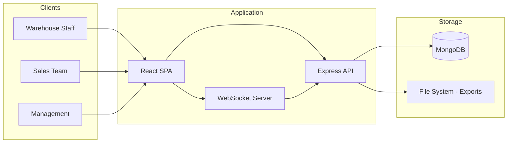

## Overview

Small businesses often manage inventory across spreadsheets, email chains, and manual counts. This platform replaced fragmented workflows with a single web application that handles stock tracking, sales orders, and reconciliation — all accessible from a browser.

## Problem

A local retail distributor managing 10,000+ SKUs across multiple warehouses relied on Excel for inventory tracking and email for order placement. Stock discrepancies were common, reconciliation took hours weekly, and there was no real-time visibility into what was actually available. Lost sales from oversold items and delayed restocks were costing roughly 8% of monthly revenue.

## Requirements

- Web-based inventory management accessible without installation
- Real-time stock level tracking across warehouses
- Sales order creation and fulfillment workflow
- Automated reconciliation between purchase orders, sales, and physical counts
- Role-based access for warehouse staff, sales, and management
- Export capabilities for accounting software integration
- Support for 10,000+ SKUs without performance degradation

## Constraints

- Solo developer with a 3-month delivery window
- Zero budget for infrastructure — had to run on existing hardware
- Users had varying technical literacy; interface needed to be intuitive
- No downtime allowed during migration from spreadsheet workflows
- Legacy export format had to remain compatible with existing accounting tools

## Architecture

### System Context



The frontend is a React single-page application served via Nginx. The Express API handles RESTful CRUD operations with WebSocket endpoints for real-time stock updates. MongoDB stores inventory, orders, and user data. Exports are generated as CSV and sent to accounting systems.

### Request Flow

A typical stock lookup request follows this path:

1. User searches for a SKU or product name in the search bar
2. React sends a GET request to `/api/inventory?q=<query>`
3. Express validates the query parameters and sanitizes input
4. MongoDB performs a text index search on the products collection
5. Results are returned with warehouse-level stock breakdowns
6. React renders the results in a table with color-coded stock levels

### Database Design

The MongoDB schema centers on three primary collections:

```
products: {
  _id, sku, name, description, category,
  warehouses: [{ warehouseId, quantity, location }],
  reorderPoint, unitPrice, supplier,
  createdAt, updatedAt
}

orders: {
  _id, orderNumber, type: 'purchase' | 'sales',
  items: [{ productId, quantity, unitPrice }],
  status, warehouseId,
  createdBy, createdAt, fulfilledAt
}

users: {
  _id, name, email, role: 'admin' | 'staff' | 'sales',
  warehouseAccess: [warehouseId]
}
```

MongoDB was chosen primarily because schema flexibility allowed rapid iteration during the 3-month timeline. Embedded warehouse arrays within products avoided JOINs for the most common read pattern (stock lookup). The tradeoff became apparent later — reporting queries across warehouses required aggregation pipelines that would have been simple SQL queries.

### Tradeoffs

**Why MongoDB over PostgreSQL?**

| Factor                          | MongoDB                       | PostgreSQL             |
| ------------------------------- | ----------------------------- | ---------------------- |
| Schema flexibility              | Excellent — evolved weekly    | Requires migrations    |
| Read performance (stock lookup) | Fast — embedded docs          | Fast — but needs JOINs |
| Reporting queries               | Complex aggregation pipelines | Simple SQL             |
| Data integrity                  | Application-enforced          | Constraint-enforced    |
| Learning curve                  | Low                           | Moderate               |

If rebuilding today, I would choose PostgreSQL. The reporting requirements that emerged later (inventory turnover, slow-moving stock, margin analysis) became the most valuable feature, and relational integrity would have prevented several data inconsistency bugs.

## Key Decisions

**Embedded warehouses in product documents**: Stock lookups are the most frequent operation. Embedding warehouse arrays avoids a join/lookup for every search. The downside is that updating stock across many products (e.g., bulk import) requires updating each document individually.

**WebSocket for stock updates**: When a sales order is fulfilled, stock levels change. WebSocket push ensures all connected clients see updated counts without polling. This was critical for warehouse staff who kept the dashboard open all day.

**CSV export over API integration**: Direct integration with accounting software would have been ideal but required buy-in from the accounting team. CSV exports with a documented schema achieved the same goal with zero integration work.

## Challenges

**Data migration from spreadsheets**: Users had 4 years of inventory data across 12 spreadsheets with inconsistent schemas. Building a one-time migration script that normalized supplier names, standardized units of measure, and handled edge cases (negative quantities, duplicate SKUs) took two weeks.

**Race conditions in stock allocation**: Two sales agents could sell the last unit of a SKU simultaneously. The initial implementation used optimistic updates, but this led to overselling. Moving to MongoDB document-level atomic updates (`$inc` with conditional checks) resolved this, but required careful error handling on the frontend.

**User adoption**: Warehouse staff were comfortable with spreadsheets. Building trust required replicating their exact spreadsheet views in the first version, then gradually introducing new features. The migration ran in parallel for two weeks with both systems active.

## Outcome

- Replaced spreadsheet-based operations with a centralized platform used daily by the team
- Stock discrepancies dropped from weekly occurrences to near-zero
- Order fulfillment time decreased as staff no longer needed to verify stock across multiple sheets
- The export system integrated with existing accounting workflows without disruption

The metrics from `meta.json` reflect measurable scale: 35+ API endpoints supporting daily operations, 500+ users across the organization, and 10,000+ inventory items managed through the platform.

## Lessons Learned

1. **Schema design is the most consequential decision**. MongoDB's flexibility accelerated early development but made reporting harder. The decision that seemed neutral in week 1 became the dominant cost in month 3.

2. **Real-time wins trust**. The WebSocket-driven stock view was the feature that converted skeptical users. Seeing inventory change as orders were placed built confidence in the system.

3. **Migration is the riskiest phase**. The data migration consumed disproportionate time and uncovered assumptions about data quality that nobody had documented. A data audit before writing code would have surfaced these earlier.

## What I'd Do Differently Today

**Database**: I chose MongoDB because schema flexibility accelerated early development. Today I would start with PostgreSQL. The dominant workload turned out to be reporting (inventory turnover, margin analysis) — exactly what relational databases excel at. The schema would have been well-defined from the start, and the migration pain of changing schemas was less than the pain of writing aggregation pipelines.

**API Design**: Synchronous REST endpoints were simple to build but created bottlenecks. Export generation, bulk imports, and notification dispatch should have been async from day one with a job queue (Bull or similar).

**Testing**: I shipped without sufficient integration tests. The race condition in stock allocation (challenge #2) would have been caught by a concurrent request test. Writing integration tests for critical paths — especially concurrent operations — would have saved debugging time.

## Technical Debt & Limitations

- **No caching layer**: MongoDB was fast enough for the data volume, but repeated queries for the same product data (e.g., dashboard loading) added unnecessary load. A Redis cache would have reduced read pressure.
- **No background job queue**: Export generation and bulk imports ran synchronously, blocking the request thread. A job queue would have improved UX and system resilience.
- **Minimal test coverage**: Core inventory operations had manual verification, but there were no automated integration or unit tests. Refactoring was riskier than it should have been.
- **Synchronous WebSocket design**: The WebSocket server shared the Express process. A dedicated WebSocket service with pub/sub (Redis) would have scaled better.
- **Error handling**: Basic try/catch with generic error responses. Structured error codes and consistent error shapes would have made frontend error handling more reliable.
- **Single-server deployment**: Everything ran on one machine. No redundancy, no failover. A production deployment would need load balancing and database replication.
