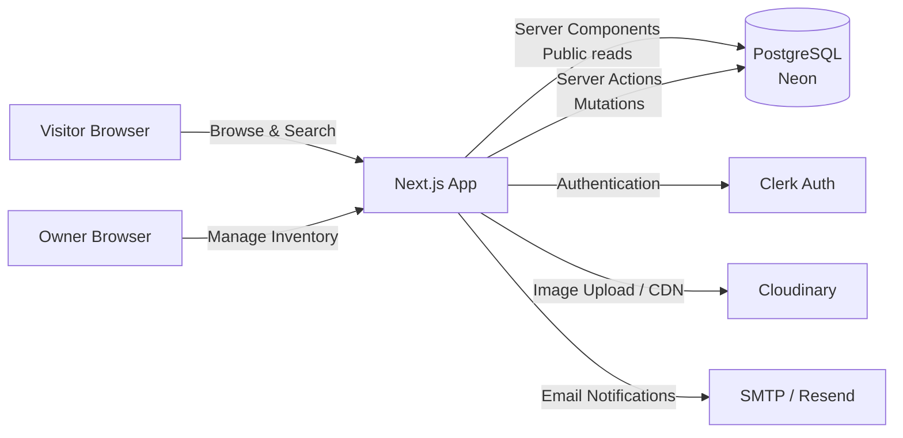
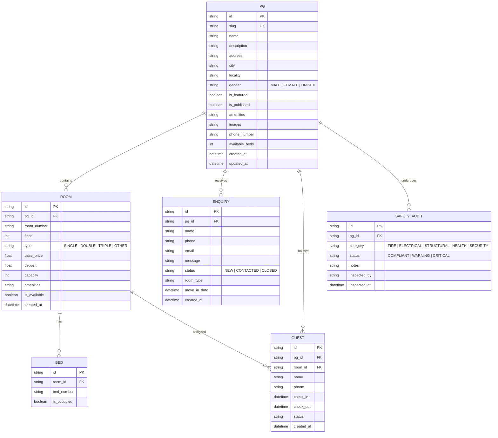
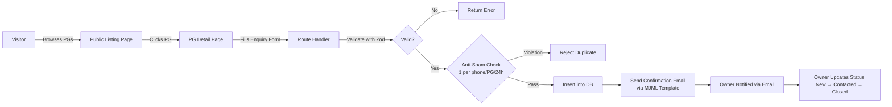
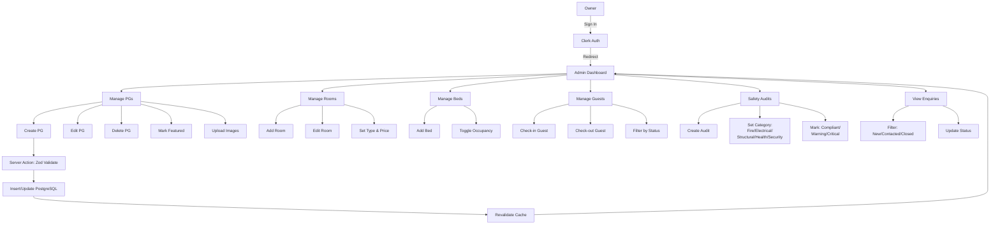

## Overview

PG Discovery & Management Platform is a full-stack web application that connects students and working professionals with verified Paying Guest (PG) accommodations across Indian cities. It features a public discovery portal for browsing and filtering properties, and a comprehensive owner CMS for managing PGs, rooms, beds, guests, and safety audits.

Built as a Next.js monolith with server components and server actions, the platform was designed to be serverless-friendly, cost-efficient, and SEO-optimized from day one.

## Problem

PG owners in India relied on offline word-of-mouth and scattered WhatsApp groups to find tenants, while students and professionals spent days visiting properties in person to find suitable accommodation. No centralized, searchable platform existed that let owners showcase their properties or let seekers filter by city, gender, amenities, and budget. Property inventory (rooms, beds, occupancy) was tracked in spreadsheets or not at all. Safety compliance — fire safety, electrical, structural — had no audit trail.

## Requirements

- Public discovery portal with city/gender/amenity filters and SEO-friendly URLs
- Owner admin dashboard for PG, room, and bed management
- Guest check-in/check-out tracking with status filters
- Safety audit system with five audit categories and compliance status
- Enquiry intake system with anti-spam rules (1 per phone per PG per 24h)
- Responsive, mobile-first design with dark mode support
- Secure authentication via Clerk with protected admin routes
- Type-safe database access with automated migrations
- Image management with automatic fallbacks and Cloudinary hosting

## Constraints

- Solo/2-person team with a 4-month MVP timeline
- No budget for paid services beyond free tiers (Neon, Clerk, Cloudinary)
- Must be serverless-deployable to keep hosting costs near zero
- No background workers or job queues in Phase-0

## Architecture

### System Context



### Request Flow

1. Visitor lands on the public site; Next.js Server Component fetches PG listings from PostgreSQL and renders HTML server-side for fast TTFB and SEO
2. Visitor filters by city or gender — query params update the server component request, returning filtered results without client-side data fetching
3. Visitor submits an enquiry via a Route Handler — validated server-side with Zod, checked against the 24h anti-spam rule, then inserted into the database
4. Owner signs in via Clerk — middleware checks auth state and redirects unauthenticated users to the sign-in page
5. Owner creates/edits a PG, room, or bed — form data is validated client-side (React Hook Form) and server-side (Zod schema), then persisted via Server Action
6. Image uploads go directly to Cloudinary via signed upload presets — only the returned URL is stored in PostgreSQL

### Database Design

```
pgs: {
  id, slug, name, description, images[], amenities[],
  city, locality, gender, is_featured, is_published,
  lat, lng, available_beds, created_at, updated_at
}

rooms: {
  id, pg_id, room_number, floor, type,
  base_price, deposit, capacity, amenities[],
  is_available, created_at, updated_at
}

beds: {
  id, room_id, is_occupied, bed_number
}

enquiries: {
  id, pg_id, name, email, phone, message,
  room_type, move_in_date, status, created_at
}

guests: {
  id, pg_id, room_id, bed_id, name, phone,
  check_in, check_out, status
}

safety_audits: {
  id, pg_id, category, status, notes,
  inspected_by, inspected_at
}
```



### Enquiry Submission Flow



### Owner CMS Workflow



## Key Decisions

**Next.js monolith over separate frontend + backend**: Using Next.js App Router with Server Components and Server Actions eliminated the need for a separate API layer in Phase-0. Public reads render entirely on the server, mutations go through type-safe Server Actions, and we avoided the complexity of maintaining two deployable services.

**Drizzle ORM over Prisma or raw SQL**: Drizzle's lightweight, SQL-like API and first-class TypeScript support made it a natural fit. Unlike Prisma, it doesn't generate a heavy client — migrations are plain SQL, and queries are composable without magic strings.

**Clerk for auth over custom JWT**: Building auth correctly is hard. Clerk handles session management, password reset, MFA, and social login out of the box. Integration via `@clerk/nextjs` middleware is a few lines of code.

**Cloudinary for images over local storage**: Offloading image transformation, optimization, and CDN delivery to Cloudinary meant no server-side image processing logic. Automatic fallback SVGs ensure broken images never show empty frames.

**Schema-Validation-Action pattern**: Every feature module follows `*.schema.ts → *.actions.ts → database` flow. Zod schemas are the single source of truth for validation on both client and server — no duplication, no drift.

## Challenges

**Ensuring type safety from database to UI**: With Drizzle's schema-first approach and Zod's runtime validation, every data path is typed. The challenge was maintaining this pipeline through Server Components (async, server-only) and client components (Zustand stores, optimistic updates). We solved it by keeping domain types in shared schemas and deriving insert/select types from Drizzle tables.

**Image management with fallbacks**: Users could upload images that later became unavailable (deleted, expired URLs). We built a centralized fallback system with per-entity SVG definitions — if Cloudinary returns a 404, the component renders a context-aware placeholder (building icon for PGs, bed icon for rooms) without breaking the layout.

**Spam-resistant enquiry system**: Without a captcha service, we implemented server-side rate limiting — one enquiry per phone number per PG per 24-hour window. This required careful index design on (pg_id, phone, created_at) and atomic upsert logic in the Route Handler.

**Responsive admin dashboard**: Building a full-featured admin CMS that works on both desktop and mobile was harder than expected. Sidebar collapse, responsive tables, and mobile-optimized forms required extensive Tailwind breakpoint tuning and a custom sidebar context via Zustand.

## Outcome

The Phase-0 MVP was deployed and is live at pg-discovery-platform.vercel.app. Property owners can now manage their full inventory — PGs, rooms, beds — through a clean dashboard. Visitors can browse properties across 4 cities, filter by gender and amenities, view detailed listings with images and pricing, and submit enquiries without creating an account. The platform achieves sub-second page loads on public pages, passes Lighthouse performance audits, and runs on free-tier infrastructure with zero monthly hosting cost.

## Lessons Learned

1. **Server Components are not just a performance optimization — they simplify state management**. By rendering public pages entirely on the server, we eliminated the need for client-side data fetching libraries, loading states, and caching layers in Phase-0. The database is the single source of truth, and the URL is the only piece of client state needed.

2. **Drizzle's SQL-like API has a learning curve but pays off**. Unlike ORMs that abstract SQL away, Drizzle requires understanding joins, indexes, and query performance. The tradeoff is full control — we hand-tune every query and write raw SQL snippets when needed without fighting an abstraction layer.

3. **Image fallbacks should be designed from day one**. Adding fallbacks after the fact meant auditing every image render path across the app. Building a centralized `FallbackImage` component with per-type SVGs upfront would have saved refactoring time.

## What I'd Do Differently Today

**Testing strategy**: Phase-0 shipped with manual QA and Lighthouse audits only. For sub-2-person teams, I'd add Playwright tests for the three critical user journeys (visitor browsing → enquiry, owner auth → property creation, owner dashboard navigation) early. They catch regressions faster than manual clicking.

**Image upload UX**: Current upload flow requires entering image names manually. I'd auto-generate labels from file metadata and use Cloudinary's auto-tagging to suggest categories, reducing data entry friction for owners.

**State management**: Zustand was used for sidebar state and a few UI toggles. In retrospect, React Context alone would have sufficed. The Zustand store added indirection without meaningful benefit for the amount of client state in Phase-0.

## Technical Debt & Limitations

- **No tenant onboarding**: Phase-0 tracks guests manually. A tenant portal with rent ledger and communication history is the natural next phase.
- **No payment integration**: Rent collection is still handled offline. Integrating Razorpay or Stripe would close the loop.
- **No background jobs**: Safety audit reminders, enquiry follow-ups, and occupancy reports are manual. Adding a lightweight queue (e.g., Inngest) would automate these.
- **No RBAC**: Every authenticated user sees all admin features. Sub-admin roles (e.g., staff who can only manage check-ins) are not implemented.
- **Manual property seeding**: Properties were seeded via a script. An owner self-onboarding flow with verification would reduce friction.
- **Single-region deployment**: Deployed on Vercel (us-east). Multi-region or edge deployment would improve latency for Indian users outside the US.
