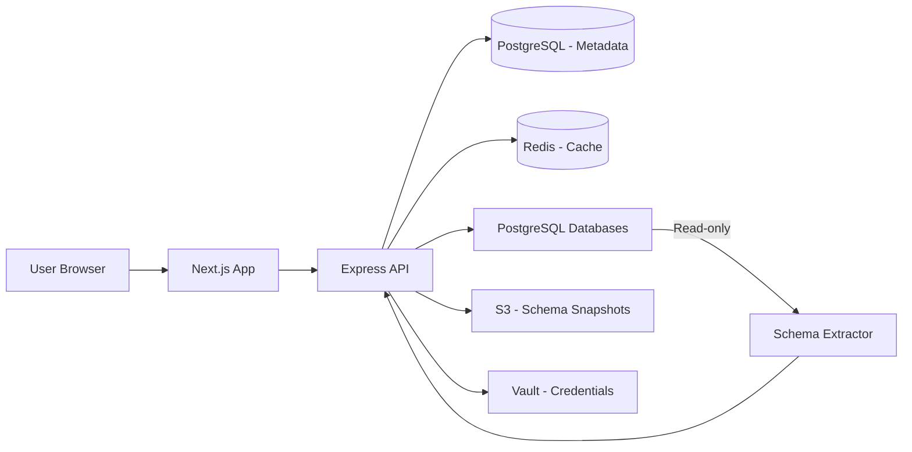

## Overview

Engineering teams managing growing PostgreSQL deployments often lack visibility into their schema — what tables exist, how they relate, which columns are indexed, and what impact a migration might have. This platform indexes PostgreSQL database schemas and provides interactive exploration, impact analysis, and migration diff generation.

## Problem

A team managing 50+ PostgreSQL databases across staging, production, and analytics environments had no centralized schema documentation. When planning migrations, engineers manually traced foreign key relationships, checked index coverage, and reviewed column types across databases. A simple column rename required cross-referencing 5+ sources. Schema drift between environments went unnoticed until deployment failed.

## Requirements

- Connect to PostgreSQL databases and extract full schema metadata
- Generate interactive ER diagrams for visual exploration
- Impact analysis — show what breaks if a column/table is modified
- Migration diff generation between two schema snapshots
- Search across all indexed schemas (tables, columns, indexes, constraints)
- Multi-user support with saved annotations on schema elements
- Handle 10,000+ tables across multiple databases without performance issues

## Constraints

- Two-person team (backend + frontend) with 4 months
- Databases could not be modified — read-only access only
- Schema metadata extraction had to complete within 30 seconds for a database with 1,000+ tables
- Impact analysis required historical snapshots — needed to store schema versions over time
- Security: credentials could not be stored in plaintext; database connections had to use temporary tokens via vault

## Architecture

### System Context



### Request Flow

1. User registers a database by providing a name and temporary Vault token
2. Backend requests a short-lived credential from Vault
3. Schema Extractor connects read-only, queries `information_schema` tables, `pg_class`, and `pg_index` to extract full metadata
4. Extracted schema is stored as a versioned JSON snapshot in PostgreSQL metadata store and S3
5. A background job analyzes relationships to build the foreign key graph
6. User can then browse tables, view ER diagrams, generate diffs, and run impact analysis

### Database Design

The metadata store uses PostgreSQL itself to store schema snapshots:

```
databases: {
  id, name, engine_version,
  created_at, updated_at
}

schema_snapshots: {
  id, database_id, version,
  tables: JSON,  -- array of table definitions
  relationships: JSON,  -- foreign key graph
  captured_at
}

tables: {
  id, snapshot_id, schema_name, table_name,
  columns: [{ name, type, nullable, default, is_primary_key }],
  indexes: [{ name, columns, unique, type }],
  constraints: [{ name, type, columns, references }],
  row_count_estimate,
  total_size_bytes
}
```

## Key Decisions

**PostgreSQL metadata stored in PostgreSQL**: Using the same database engine for storage was intentional — it meant we could use `information_schema` comparison logic written in SQL directly against our metadata. No impedance mismatch.

**Snapshot-based versioning**: Instead of tracking incremental changes (which would require detecting what changed), we snapshot the full schema on each scan. Storage is cheap, and diffing two snapshots is straightforward JSON comparison. This also simplifies rollback analysis.

**Separate schema extractor process**: Extraction runs as a background job with configurable concurrency. For databases with 1,000+ tables, single-threaded extraction was too slow. The extractor parallelizes by schema namespace.

## Challenges

**Extracting accurate metadata at scale**: PostgreSQL's `information_schema` is slow for databases with many columns. We optimized by querying `pg_catalog` directly and joining with `pg_stats` for column statistics. Performance improved from 45 seconds to 8 seconds for a 1,000-table database.

**Foreign key graph construction**: Building the complete dependency graph required resolving cross-schema foreign keys, which PostgreSQL allows but `information_schema` doesn't expose cleanly. We had to query `pg_constraint` directly and resolve schema/table OIDs manually.

**Impact analysis accuracy**: Determining "what breaks if this column is renamed" means transitively tracing all views, functions, triggers, and application queries that reference the column. Full static analysis was out of scope; we settled for reporting all direct dependencies in the schema (views, functions, triggers) and marking application-level analysis as a manual step.

## Outcome

- Reduced schema audit time from hours to minutes for the engineering team
- Migration planning became safe — engineers could preview impact before writing migration scripts
- Environment drift detection — automated comparison between staging and production schemas caught inconsistencies before deployments
- The tool became the source of truth for schema documentation, replacing scattered wiki pages

## Lessons Learned

1. **Read-only access is a hard constraint that simplifies design**. Not being able to modify databases forced us into a clean observer architecture. Adding advisory locks or audit triggers would have complicated the system significantly.

2. **Schema metadata is more complex than it seems**. PostgreSQL's catalog is rich but inconsistent across versions. Supporting 10+ minor versions required extensive testing and version-specific queries.

3. **Performance optimization should start at the query level**. The initial implementation blamed network latency, but the real bottleneck was naive `information_schema` queries. Rewriting against `pg_catalog` gave 5x improvement without any infrastructure changes.

## What I'd Do Differently Today

**Architecture**: The separate schema extractor process was the right call, but it communicated via the API server, creating a bottleneck. Today I'd give the extractor its own write path to the metadata store and communicate results via an event bus (Redis pub/sub or NATS).

**Snapshot storage**: JSON snapshots in PostgreSQL worked but querying them was awkward. Today I'd use a document store for snapshots and keep only current metadata + indexes in PostgreSQL. The hybrid approach would simplify both writing and querying.

**Impact analysis scope**: The decision to skip application-level static analysis was pragmatic but limited the tool's value. A v2 should support SQL query parsing to detect application-level dependencies. Tools like `pg_query` (libpg_query bindings) could parse raw SQL without a full database connection.

## Technical Debt & Limitations

- **No real-time schema change detection**: The tool relies on periodic scans. A logical replication slot would enable real-time change detection.
- **No query plan analysis**: Schema metadata is useful, but combining it with query execution plans would help identify missing indexes and slow patterns.
- **Limited multi-engine support**: PostgreSQL only. MySQL and SQL Server support would require significant rework of the extraction layer.
- **No RBAC within the tool**: Users could see all databases registered in the system. Fine-grained access control was deprioritized.
- **Manual database registration**: Each database must be manually registered. Auto-discovery via network scan or cloud provider integration would improve adoption.
- **Snapshot storage growth**: Full snapshots for every scan consume storage proportional to schema size x scan frequency. Incremental diff storage would reduce this.
