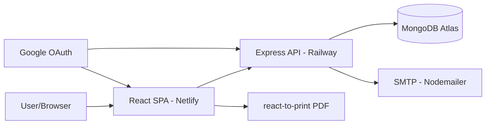

## Overview

A full-stack web application for managing a sweet shop's operations — built as a personal learning project to deepen understanding of role-based access control, JWT authentication, and full-stack development with the MERN stack. The system serves three user roles (Admin, Staff, Customer) with cleanly separated feature sets: Admin oversees all accounts and data but cannot place orders, Staff manages inventory and sweets data, and Customers browse, purchase, and track their payment history.

The frontend is deployed on Netlify, the Express API on Railway, and data is persisted in MongoDB Atlas. Authentication supports both email/password with verification and Google SSO.

## Problem

Small sweet shops typically manage inventory, staff access, and sales through disconnected tools or manual spreadsheets. There was no centralized platform that combined role-specific dashboards, secure access with approval workflows, and end-to-end transaction tracking in a single system. Key pain points included uncontrolled staff access to critical inventory data, lack of audit trails for changes, and no unified view of business health.

## Requirements

- Role-based access with three distinct roles: Admin, Staff, and Customer
- Secure authentication via email/password with email verification and Google SSO
- Admin-only user management — create, delete, update roles, verify staff approvals
- Sweet inventory CRUD with real-time stock tracking and low-stock alerts
- Production task assignment per sweet item (todo, in-progress, done)
- Payment processing with multiple methods (UPI, card, netbanking, cash)
- PDF report generation for inventory valuation and customer analytics
- Email-based password reset and verification flows
- Audit logging for all protected actions

## Constraints

- Single developer building both frontend and backend from scratch
- Free-tier hosting — Netlify (frontend), Railway (backend), MongoDB Atlas (database)
- MongoDB Atlas free tier limits — 512MB storage, shared cluster performance
- ESM module system across both frontend and backend for consistency

## Architecture

### System Context



### Request Flow

1. User authenticates via email/password or Google SSO; server issues JWT access token (1-day) and refresh token (10-day) stored in httpOnly cookies
2. Frontend API client (custom fetch wrapper) automatically includes credentials on every request
3. Express middleware chain processes each request — cors → json → cookieParser → verifyJWT → checkPermission
4. Route handler executes business logic and queries MongoDB via Mongoose models
5. Responses follow a unified ApiResponse wrapper; errors bubble to a global error middleware

### Database Design

```
User: {
  _id, username, email, password(bcrypt), role[admin|staff|customer],
  isEmailVerified, refreshToken, googleId, payments[],
  forgotPasswordToken, emailVerificationToken, timestamps
}

Sweet: {
  _id, name, description, price, quantityInStock,
  productionTasks: [{ title, status[todo|in_progress|done],
                      assignedTo, dueDate }],
  lastUpdatedBy, lastUpdatedByPermission, timestamps
}

Payment: {
  _id, user(ref), items: [{ sweet(ref), quantity }],
  amount, currency, status[pending|success|failed|refunded],
  method[upi|card|netbanking|cash], provider, transactionId, paidAt
}

AuditLog: {
  _id, user(ref), action, resourceType, resourceId,
  permissionUsed, metadata, timestamps
}
```

## Key Decisions

**Granular permission strings over simple role checks**: Instead of checking `role === 'admin'` in every handler, designed a permission-mapping system (`create:sweet`, `update:inventory`, `view:inventory`, `manage:users`) mapped to roles. This made access control flexible — adding a new role requires only updating the permission map, not touching route handlers. Tradeoff: slightly more middleware boilerplate upfront.

**Cookie-based JWT over localStorage**: Storing tokens in httpOnly cookies prevents XSS-based token theft at the cost of more complex CORS configuration and requiring cookie-parser middleware. Worth it for security in a production-facing app.

**Modular monolith over microservices**: Backend is organized into feature modules (auth, sweets, inventory, payments, users) within a single Express app. This kept deployment trivial while maintaining clean separation — each module has its own controller, routes, and tests.

**MongoDB over relational database**: Chose MongoDB for rapid iteration and flexible sub-document schemas (embedded production tasks, payment items). The tradeoff — no ACID guarantees across collections and manual referential integrity — became noticeable in payment and inventory transactions.

## Challenges

**ESM + Jest compatibility**: This was the first project using ES modules across the full stack. Getting Jest to work with ESM required the `--experimental-vm-modules` flag, careful module mocking for Mongoose models, and debugging import resolution issues. MongoDB Memory Server also had intermittent download failures that were hard to diagnose.

**MongoDB schema design for ecommerce-style data**: Translating entities (users, sweets, payments, tasks) into document schemas required deciding what to embed vs. reference. Production tasks became sub-documents; payment line items remained references. Getting this wrong early meant schema migrations mid-project.

**PDF report generation with react-to-print**: Achieving consistent 20mm margins, clean page breaks, and cross-browser rendering required extensive CSS media query debugging.

## Outcome

The system was fully deployed with a live frontend on Netlify and backend on Railway. It handles the complete sweet shop workflow from staff onboarding (registration → admin approval → access granted) to inventory management, customer sweet purchasing, payment tracking, and professional PDF reporting. The RBAC system cleanly separates concerns — Admin oversees accounts and analytics, Staff manages inventory and edits sweet data, Customers browse and purchase sweets. Authentication supports both email/password with verification and Google SSO.

## Lessons Learned

1. **Granular permissions scale better than hardcoded role checks**: Starting with string-based permissions rather than `if (role === 'admin')` made it trivial to later add the Staff role without touching a single route handler.

2. **Cookie-based auth requires meticulous CORS planning**: httpOnly cookies simplify frontend security but introduce subtle bugs in cross-origin scenarios — especially during development with different ports for frontend and backend.

3. **Test infrastructure setup is significant**: MongoMemoryServer plus ESM Jest configuration took nearly as long as writing the first feature tests. Worth the investment for isolated, deterministic test runs.

## What I'd Do Differently Today

**Use PostgreSQL instead of MongoDB**: The RBAC system's reliance on consistent permission mapping, combined with payment and inventory transactions that would benefit from ACID guarantees, makes a relational database a better fit in hindsight. The flexible document model was convenient for prototyping but introduced complexity around referential integrity.

**Set up CI/CD from day one**: Manual deployments to Netlify and Railway became hectic. A GitHub Actions pipeline with automated testing, linting, and deployment would have eliminated repetitive manual steps.

**Adopt TypeScript**: The project crossed the threshold where runtime type errors from mismatched API response shapes and model schemas became a recurring friction point. TypeScript would have caught these at compile time.

## Technical Debt & Limitations

- **No rate limiting**: Auth endpoints are vulnerable to brute-force attacks — rate limiting should be added with express-rate-limit
- **Minimal test coverage**: Only auth and sweets modules have tests; payments, admin, and inventory modules lack coverage
- **No pagination on admin user endpoint**: Returns all users in a single response, which will degrade with scale
- **MongoDB Atlas free tier**: 512MB storage cap and shared cluster performance limit production scalability
- **No automated CI/CD**: Deployments are manual to Netlify and Railway, increasing risk of human error
