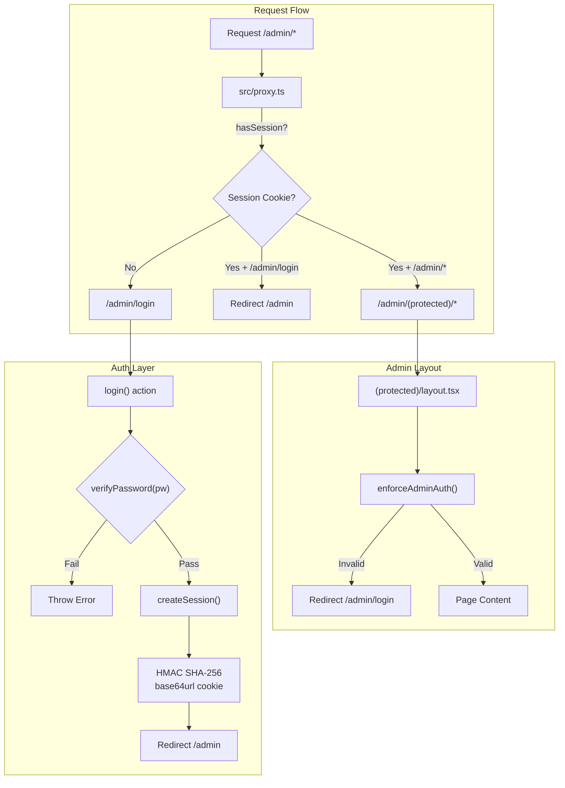
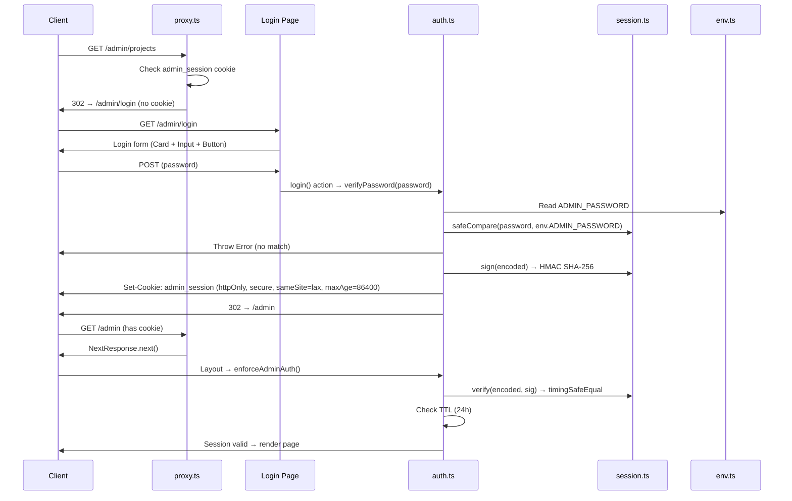
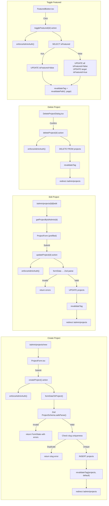
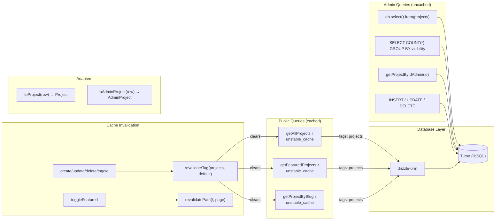
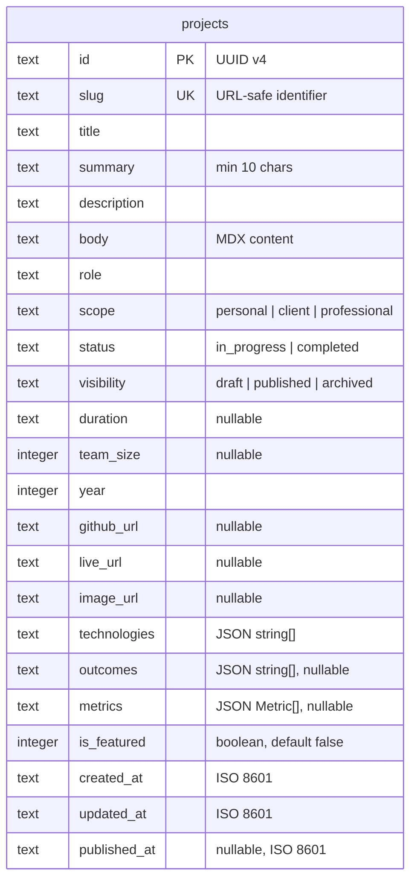

# Admin Panel Architecture

**Date:** 2026-06-13T23:00:00+05:30  
**Branch:** `feat/admin-panel`  
**Next.js:** 16.2.7 | **Turso:** libSQL | **Drizzle ORM:** 0.45.2

---

## File Map

```
src/
├── proxy.ts                          # Auth guard — intercepts /admin/* requests
├── lib/
│   ├── admin/
│   │   ├── auth.ts                   # verifyPassword, createSession, verifySession, destroySession, enforceAdminAuth
│   │   └── session.ts                # HMAC SHA-256 sign/verify, base64url encode/decode, safeCompare
│   ├── content/
│   │   ├── schema.ts                 # Zod ProjectSchema, MetricSchema, SCOPES/STATUSES/VISIBILITIES constants
│   │   ├── types.ts                  # Project, Metric, AdminProject (Project + id + isFeatured)
│   │   └── projects.ts               # Adapter: toProject, toAdminProject, cached public queries, direct admin query
│   ├── db/
│   │   ├── client.ts                 # Turso + Drizzle client (singleton)
│   │   └── schema.ts                 # Drizzle projects table: 18 columns, 2 indexes, 2 CHECK constraints
│   ├── env.ts                        # Zod-validated env: TURSO_DB_URL, TURSO_AUTH_TOKEN, ADMIN_PASSWORD, ADMIN_SESSION_SECRET
│   └── constants.ts                  # SITE, SOCIAL, EMPLOYMENT, NAVIGATION (shared by public + admin)
├── app/
│   ├── layout.tsx                    # Root shell — html, body, fonts, ThemeProvider only
│   ├── (public)/
│   │   ├── layout.tsx                # Public layout — Header + <main>{children}
│   │   ├── page.tsx                  # Homepage (/)
│   │   ├── about/page.tsx            # About page (/about)
│   │   ├── opengraph-image.tsx       # Root OG image
│   │   └── projects/
│   │       ├── page.tsx              # Projects list (/projects)
│   │       └── [slug]/
│   │           ├── page.tsx          # Project detail (/projects/[slug])
│   │           └── opengraph-image.tsx  # Per-project OG image
│   ├── admin/
│   │   ├── login/
│   │   │   ├── page.tsx              # Login form — Card + shadcn Input/Button
│   │   │   └── actions.ts            # login() server action — verifyPassword → createSession → redirect
│   │   └── (protected)/
│   │       ├── layout.tsx            # Admin layout — enforceAdminAuth, sticky header, theme toggle, logout
│   │       ├── page.tsx              # Dashboard — project count stats, quick actions
│   │       └── projects/
│   │           ├── page.tsx          # Projects table — all projects, featured star, actions
│   │           ├── new/page.tsx      # Create project — ProjectForm bound to createProject
│   │           └── [id]/edit/
│   │               └── page.tsx      # Edit project — ProjectForm bound to updateProject, delete dialog
│   └── actions/
│       ├── projects.ts               # Server actions: createProject, updateProject, deleteProject, toggleFeatured
│       └── logout.ts                 # logout() — destroySession → redirect /admin/login
├── components/
│   ├── admin/
│   │   ├── ProjectForm.tsx           # useActionState form, dynamic arrays (tech/outcomes/metrics), Save/Publish buttons
│   │   ├── FeaturedButton.tsx        # Star toggle — Lucide Star + Tooltip, calls toggleFeatured(id)
│   │   └── DeleteProjectDialog.tsx   # AlertDialog confirmation, calls deleteProject(id)
│   ├── layout/
│   │   ├── Header.tsx                # Public header: site name + Navigation
│   │   ├── Navigation.tsx            # Mobile-responsive nav with shadcn Sheet
│   │   ├── ThemeToggle.tsx           # Sun/Moon toggle using next-themes (shared by public + admin)
│   │   └── Container.tsx             # Max-width layout wrapper
│   └── ui/                           # shadcn components: card, button, input, textarea, label, badge, tooltip, alert-dialog, separator, sheet
├── drizzle/                          # Migration files: 0000_initial, 0001_, 0002_, 0003_ (is_featured migration)
└── scripts/
    └── seed.ts                       # Idempotent seed — reads content/projects/*/meta.json + content.mdx
```

---

## Architecture Overview



**Proxy guard logic** (`proxy.ts`):

| Path           | Has cookie | Action                             |
| -------------- | ---------- | ---------------------------------- |
| `/admin/login` | No         | `NextResponse.next()` (show login) |
| `/admin/login` | Yes        | Redirect to `/admin`               |
| `/admin/*`     | No         | Redirect to `/admin/login`         |
| `/admin/*`     | Yes        | `NextResponse.next()` (proceed)    |

---

## Authentication Flow



### HMAC Session Format

```
token = base64url(JSON.stringify({ t: timestamp, r: randomUUID })) + "." + HMAC-SHA256(payload, ADMIN_SESSION_SECRET)
```

Cookie: `admin_session=<token>`, httpOnly, secure in production, sameSite lax, 24h TTL.

---

## Admin CRUD Flow



### Visibility from `_action`

The form's Save Draft / Publish / Unpublish buttons use a hidden field `_action`:

```ts
visibility = formData.get("_action") === "publish" ? "published" : "draft";
```

When `_action` is `"publish"` → `visibility = "published"`.  
When `_action` is `"draft"` or `"unpublish"` → `visibility = "draft"`.

### `publishedAt` Server-Managed

- **Create:** Set to `now` if `visibility === "published"`, else `null`
- **Update:** Preserve existing `publishedAt` if already set; set to `now` on first publish
- **Never** accepted from form input or Zod validation

---

## Data Architecture



### Key Distinctions

| Aspect           | Public (`(public)/`)                 | Admin (`admin/(protected)/`)                    |
| ---------------- | ------------------------------------ | ----------------------------------------------- |
| **URL identity** | `slug`                               | `id` (UUID)                                     |
| **Query**        | `getProjectBySlug(slug)`             | `getProjectByIdAdmin(id)`                       |
| **Cache**        | `unstable_cache` with tags           | Direct `db.select()` — no cache                 |
| **Types**        | `Project` (no `id`, no `isFeatured`) | `AdminProject` = `Project & { id, isFeatured }` |
| **Mutations**    | None                                 | Server actions with `enforceAdminAuth()`        |

---

## DB Schema



### Indexes & Constraints

| Name               | Type  | Definition                                         |
| ------------------ | ----- | -------------------------------------------------- |
| `status_check`     | CHECK | `status IN ('completed', 'in_progress')`           |
| `visibility_check` | CHECK | `visibility IN ('draft', 'published', 'archived')` |
| `visibility_idx`   | INDEX | `visibility`                                       |
| `is_featured_idx`  | INDEX | `is_featured`                                      |

### Auto-Handled Fields

| Field         | Set by                                     | When                              |
| ------------- | ------------------------------------------ | --------------------------------- |
| `id`          | Server action (`crypto.randomUUID()`)      | Create only                       |
| `createdAt`   | Server action (`new Date().toISOString()`) | Create only                       |
| `updatedAt`   | Server action                              | Create + every update             |
| `publishedAt` | Server action                              | First time visibility → published |
| `isFeatured`  | `toggleFeatured()` action                  | Admin star toggle                 |

---

## Environment Variables

| Variable               | Purpose           | Validation           |
| ---------------------- | ----------------- | -------------------- |
| `TURSO_DATABASE_URL`   | Turso DB endpoint | `z.string().url()`   |
| `TURSO_AUTH_TOKEN`     | Turso auth token  | `z.string().min(1)`  |
| `ADMIN_PASSWORD`       | Login password    | `z.string().min(8)`  |
| `ADMIN_SESSION_SECRET` | HMAC signing key  | `z.string().min(16)` |

Secrets are validated at startup by `src/lib/env.ts` using Zod. Invalid/missing env vars throw on import.

---

## Seed Script

```bash
pnpm tsx scripts/seed.ts
```

Reads `content/projects/<slug>/meta.json` + `content.mdx`, maps legacy statuses, and upserts into Turso via `ON CONFLICT DO UPDATE`. Idempotent — safe to run multiple times.

**Migration commands:**

| Command            | Purpose                                |
| ------------------ | -------------------------------------- |
| `pnpm db:generate` | Generate migration from schema changes |
| `pnpm db:push`     | Push migration to Turso (requires TTY) |
| `pnpm db:studio`   | Open Drizzle Studio (GUI browser)      |

---

## Next.js 16 Constraints

- `revalidateTag(tag, profile)` requires 2 args — use `"default"` as profile
- `proxy.ts` replaces deprecated `middleware.ts` — runs on Node.js runtime
- `proxy.ts` export name is `proxy` (not `middleware`)
- Route groups `(public)` and `(protected)` are URL-transparent
- Layouts cannot conditionally hide elements based on route — use route groups instead

## Key Commands

```bash
pnpm dev            # Start dev server
pnpm build          # Production build
pnpm lint           # Lint check (use: npx eslint .)
pnpm db:push        # Push Drizzle migrations to Turso
pnpm tsx scripts/seed.ts  # Seed/reseed project data
```
