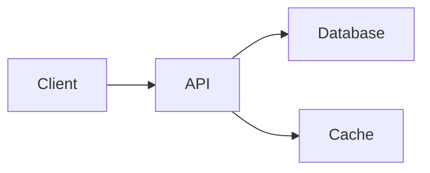

# Premium Personal Engineering Portfolio

## Final Implementation Plan

**Version**: 3.2 (Final, Locked)  
**Date**: June 9, 2026  
**Philosophy**: Personal engineering product that evolves 3-5 years without redesign

---

## 🎯 Core Vision

This is NOT a portfolio website.

It's a **personal engineering product** that:

- Shows what you build (projects)
- Shows what you think (notes/blogs)
- Shows who you are (about)
- Evolves for 3-5 years without redesign

**Visual Philosophy**: Abdul Momin + Lorenzo Migliorero + Sabato Studio

- Calm, not flashy
- Depth-focused, not breadth
- High signal-to-noise
- Premium, minimal

---

## 📱 Site Structure

### Navigation (4 items)

```
Home
Projects
About
Resume ↗ (PDF download)

(Writing appears later when notes/blogs exist)
```

### Pages

**Home** (Gateway - Minimal, High Signal)

```
Hero
  Name
  Role
  "Currently building: Authentication systems,
   backend APIs, and scalable SaaS foundations."
  (No CTAs — let whitespace breathe)
Featured Project (one deep case study)
Selected Projects (3 minimal cards → project pages)
Current Focus (what you're actively investing in)
Footer (Available for opportunities + Email + LinkedIn + GitHub + Resume)
```

**Projects** (`/projects`)

```
Grid of project cards
Minimal cards: Title + Description + Tags + Link
Each links to detail page
```

**Project Detail** (`/projects/[slug]`)

```
Overview (hero image + description)
Quick Facts (Role, Duration, Team Size, Scope, Status)
Problem (what was broken?)
Requirements (what needed to work?)
Constraints (solo dev, 8 weeks, backward compatibility, no budget)
Architecture (system context + request flow + database design + tradeoffs)
Key Decisions (why these choices?)
Challenges (what was hard?)
Tradeoffs (pros/cons, if rebuilding today?)
Outcome (measurable results with metrics + qualitative)
Lessons Learned (what you'd change)
What I'd Do Differently Today (engineering growth reflection)
Technical Debt & Limitations (honest engineering perspective)
```

**About** (`/about`)

```
Who I Am (personality, background)
Experience (Software Engineer - working primarily on...)
What I Build (types of problems you love)
Current Focus (areas actively investing time in)
Engineering Interests (long-term curiosity — auth, multi-tenant, system design)
Learning Roadmap (future direction)
Outside Engineering (hobbies, interests)
```

**Writing** (`/writing`) - _Auto-hidden until notes/blogs exist: `const showWriting = notes.length > 0 \|\| blogs.length > 0`_

```
Notes + Blogs combined list
Newest first
Links to individual posts
```

---

## 🗂️ Folder Structure

```
portfolio/
├── content/
│   ├── notes.json                 # (Phase 2+)
│   ├── blogs.json                 # (Phase 3+)
│   │
│   ├── projects/
│   │   ├── inventory-sales-platform/
│   │   │   ├── meta.json          # (id, slug, title, summary, featuredRank, etc.)
│   │   │   ├── content.mdx        # Long-form case study
│   │   │   ├── diagrams/          # .mmd files (system-context, request-flow, database-design)
│   │   │   └── assets/            # hero.png, dashboard.png, etc.
│   │   │
│   │   ├── pg-discovery-platform/
│   │   │   ├── meta.json
│   │   │   ├── content.mdx
│   │   │   ├── diagrams/
│   │   │   └── assets/
│   │   │
│   │   └── food-ordering-platform/
│   │       ├── meta.json
│   │       ├── content.mdx
│   │       ├── diagrams/
│   │       └── assets/
│   │
│   ├── notes/                     # Short technical notes (Phase 2+)
│   │   └── .gitkeep
│   │
│   └── blogs/                     # Long-form articles (Phase 3+)
│       └── .gitkeep
│
├── src/
│   ├── app/
│   │   ├── page.tsx                (home)
│   │   ├── layout.tsx              (nav: Home/Projects/About)
│   │   │
│   │   ├── projects/
│   │   │   ├── page.tsx            (projects list/grid)
│   │   │   └── [slug]/
│   │   │       └── page.tsx        (project detail - DEPTH)
│   │   │
│   │   ├── about/
│   │   │   └── page.tsx
│   │   │
│   │   └── writing/                # Added when notes/blogs exist (Phase 2+)
│   │       ├── page.tsx
│   │       └── [slug]/
│   │           └── page.tsx
│   │
│   ├── components/
│   │   ├── sections/
│   │   │   ├── Hero.tsx
│   │   │   ├── FeaturedProject.tsx
│   │   │   ├── CurrentFocus.tsx
│   │   │   ├── ProjectsGrid.tsx
│   │   │   └── Footer.tsx
│   │   │
│   │   ├── cards/
│   │   │   └── ProjectCard.tsx     (minimal: title, summary, tags, link)
│   │   │
│   │   ├── layout/
│   │   │   ├── Header.tsx
│   │   │   ├── Navigation.tsx      (shows/hides Writing)
│   │   │   └── Container.tsx
│   │   │
│   │   └── ui/
│   │       ├── Button.tsx
│   │       ├── Badge.tsx
│   │       └── Icon.tsx
│   │
│   ├── lib/
│   │   ├── content/
│   │   │   ├── projects.ts         (content access layer — imports JSON + exports helpers)
│   │   │   ├── types.ts            (TS types + Zod schemas)
│   │   │   └── schema.ts           (Zod validation — ProjectSchema.parse(data))
│   │   │
│   │   ├── mdx/
│   │   │   ├── processor.ts
│   │   │   └── loader.ts
│   │   │
│   │   ├── seo/
│   │   │   └── metadata.ts
│   │   │
│   │   └── utils/
│   │       ├── cn.ts
│   │       └── format-date.ts
│   │
│   └── styles/
│       ├── globals.css
│       └── animations.css
│
└── docs/
    ├── README.md (this)
    ├── FINAL_PLAN.md
    └── VISUAL_COMPARISON.md
```

---

## 🏗️ Content Architecture (CRITICAL)

**Why**: Decouple content metadata from rendering. Enables scaling without redesign.

### Hybrid Model: JSON + MDX + TS Helper Layer

```
                   Content Files
                        ↓
            Content Access Layer (lib/content/*.ts)
                        ↓
                  UI Components
```

### Layer 1 — Per-Project Metadata (`content/projects/*/meta.json`)

Each project has its own `meta.json`. Used by cards, grids, filters.

```json
{
  "id": "inventory-sales-platform",
  "slug": "inventory-sales-platform",
  "title": "Inventory & Sales Management Platform",
  "summary": "Built a centralized inventory and sales workflow platform replacing spreadsheet-driven operations.",
  "description": "Centralized inventory tracking and sales workflows",
  "featuredRank": 10,
  "scope": "personal",
  "status": "completed",
  "role": "Full-Stack Developer",
  "teamSize": 1,
  "duration": "3 months",
  "year": 2024,
  "completedAt": "2024-08",
  "technologies": ["React", "Node.js", "Express", "MongoDB"],
  "outcomes": [
    "Centralized inventory workflows",
    "Reduced manual reconciliation",
    "Improved stock visibility"
  ],
  "metrics": [
    { "label": "API Endpoints", "value": "35+" },
    { "label": "Users", "value": "500+" },
    { "label": "Inventory Items", "value": "10,000+" }
  ],
  "github": "https://github.com/prashant/...",
  "image": "/images/projects/inventory.jpg"
}
```

### Layer 2 — MDX Content (`content/projects/*/content.mdx`)

Long-form case study content. No frontmatter — metadata lives in sibling `meta.json`.

```
content/projects/inventory-sales-platform/
├── meta.json
└── content.mdx
```

### Layer 3 — Content Access Layer (`lib/content/projects.ts`)

Scans per-project `meta.json` files, validates with Zod, exports typed helpers. UI never reads `meta.json` directly.

```typescript
import fs from "fs";
import path from "path";
import { ProjectSchema, type Project } from "./schema";

const PROJECTS_DIR = path.join(process.cwd(), "content/projects");

export function getAllProjects(): Project[] {
  const dirs = fs
    .readdirSync(PROJECTS_DIR, { withFileTypes: true })
    .filter((d) => d.isDirectory());

  return dirs.map((dir) => {
    const meta = JSON.parse(
      fs.readFileSync(path.join(PROJECTS_DIR, dir.name, "meta.json"), "utf-8")
    );
    return ProjectSchema.parse(meta);
  });
}

export function getFeaturedProjects(): Project[] {
  return getAllProjects()
    .filter((p) => p.featuredRank !== undefined)
    .sort((a, b) => (a.featuredRank ?? 999) - (b.featuredRank ?? 999));
}

export function getProjectBySlug(slug: string): Project | undefined {
  return getAllProjects().find((p) => p.slug === slug);
}
```

### Layer 4 — Schema Validation (`lib/content/schema.ts`)

Zod validates each `meta.json` at read time. One typo fails the build.

```typescript
import { z } from "zod";

export const MetricSchema = z.object({
  label: z.string(),
  value: z.string(),
});

export const ProjectSchema = z.object({
  id: z.string(),
  slug: z.string(),
  title: z.string(),
  summary: z.string(),
  description: z.string(),
  featuredRank: z.number().optional(),
  scope: z.enum(["personal", "client", "professional"]),
  status: z.enum(["active", "completed", "archived"]),
  role: z.string(),
  teamSize: z.number().optional(),
  duration: z.string().optional(),
  year: z.number(),
  completedAt: z.string().optional(),
  technologies: z.array(z.string()),
  outcomes: z.array(z.string()).optional(),
  metrics: z.array(MetricSchema).optional(),
  github: z.string().optional(),
  liveUrl: z.string().optional(),
  image: z.string().optional(),
});
```

### Usage in Components

```tsx
import { getFeaturedProjects } from "@/lib/content/projects";

// Never: import meta.json directly
// The helper layer prevents UI coupling to storage format.
```

**Benefits**:

- ✅ Add project: create `project-name/meta.json` + `project-name/content.mdx`
- ✅ Change featured: update `featuredRank` in one file (no central registry to find/reorder)
- ✅ No duplicated metadata (no MDX frontmatter)
- ✅ `id` decouples internal references from slug
- ✅ `summary` serves homepage cards; `outcomes[]` serves project pages
- ✅ Zod validates each `meta.json` at read time — schema drift fails the build
- ✅ Self-contained projects (move/copy/archive a folder, not edit a JSON array)

---

## 📝 Content Structure

### Projects (Phase 1)

Each project is a folder with `meta.json` + `content.mdx`. No MDX frontmatter.

```
content/projects/inventory-sales-platform/
├── meta.json        # metadata only
└── content.mdx      # content only
```

````mdx
# Overview

[Hero paragraph]

_Quick Facts rendered from `meta.json` (role, teamSize, duration, scope, status)_

## Problem

[What was broken? 2-3 paragraphs]

## Requirements

[What needed to work? Acceptance criteria]

## Constraints

- Solo developer, 8 week timeline
- Existing database schema could not be changed
- Must remain backward compatible with legacy exports
- Zero budget for infrastructure or third-party services

## Architecture

### System Context

[High-level system diagram + explanation of how components interact]


````

### Request Flow

[Step-by-step walkthrough of a typical request path]

### Database Design

[Schema decisions, key models, relationships]

### Tradeoffs

[Why this architecture over alternatives]

## Key Decisions

- Why React for frontend
- Why Node.js for backend
- Why MongoDB for database
- Authentication approach

## Challenges

[What was technically hard? How did you solve it?]

## Tradeoffs

**Why MongoDB?**
Pros:

- Flexible schema for rapid iteration
- Decent performance for read patterns

Cons:

- Complex reporting queries later
- Less relational integrity

If rebuilding today:

- PostgreSQL with proper schema design
- Clearer data relationships
- Better for future analytics

## Outcome

- Replaced spreadsheet-based workflows with a centralized platform
- Improved inventory visibility across X warehouse locations
- Reduced duplicate data entry
- Revealed schema design limitations that informed later projects

## Lessons Learned

1. Schema design matters more than flexibility
2. Early decisions have long-term costs
3. Testing edge cases earlier would have helped

## What I'd Do Differently Today

**Database**: I chose MongoDB because schema flexibility accelerated early development. Today I would choose PostgreSQL because reporting queries became the dominant workload — relational integrity and query power matter more at scale.

**API Design**: I built synchronous endpoints for simplicity. An async event-driven approach with background job queues would better handle the export and notification workloads that emerged later.

**Testing**: I shipped without sufficient test coverage. Writing integration tests from day one would have caught edge cases earlier and made refactoring safer.

## Technical Debt & Limitations

- No caching layer (queries slow with large datasets)
- Missing unit/integration test coverage
- No background job queue (critical operations block requests)
- Single-region deployment (no failover)
- Synchronous API design (better as async)
- Basic error handling (needs structured logging)

````

### Notes (Phase 2+)
```mdx
---
slug: rbac-fundamentals
title: RBAC Fundamentals
description: Understanding role-based access control
date: 2025-03-15
readTime: 5
---

# RBAC Fundamentals

[Content]
````

### Blogs (Phase 3+)

```mdx
---
slug: designing-auth-systems
title: Designing Authentication Systems for Scale
description: Deep dive into modern auth patterns
date: 2025-06-01
readTime: 15
---

[Full article]
```

---

## 🎨 Design System

### Colors

```
Background: #0A0A0A (deep black)
Text: #FAFAFA (warm white)
Secondary: #A1A1AA (soft gray)
Accent: #3B82F6 (blue)
Borders: #27272A (dark gray)
```

### Typography

```
Hero H1: 48-64px
Section H2: 32-40px
Body: 16px
Line-height: 1.6
Font: System stack for performance
```

### Spacing

```
Sections: 80px+ (generous)
Cards: 24px padding
Whitespace: 40%+ of viewport
```

---

## 🎯 Homepage Layout (Final)

```
┌─────────────────────────────────────┐
│  Hero                               │
│  Name, Role                         │
│  "Currently building: Auth, APIs,   │
│   and scalable SaaS foundations."   │
│  [Large whitespace — no CTAs]       │
├─────────────────────────────────────┤
│  Featured Project                   │
│  [Image + Problem + CTA]            │
│  [Generous breathing room]          │
├─────────────────────────────────────┤
│  Selected Projects                  │
│  3 minimal cards:                   │
│  - Title                            │
│  - Summary (1 sentence, from JSON)  │
│  - Tags                             │
│  - → View Case Study                │
├─────────────────────────────────────┤
│  Current Focus                      │
│  • Authentication & Authorization   │
│  • Backend Architecture             │
│  • System Design                    │
│  • Multi-Tenant SaaS                │
├─────────────────────────────────────┤
│  Footer                             │
│  Available for opportunities         │
│  Email | LinkedIn | GitHub | Resume │
└─────────────────────────────────────┘

Visual Density: ~100 units (premium minimal)
Scroll time: 25-35 seconds
Flow: Hero → Featured → Selected Projects → Current Focus → Footer
Reason: Recruiter flow — who are you → show best work → show more → what's next.
        Projects are more valuable than current interests for hiring decisions.
        CTAs added later if analytics show users getting lost.
```

---

## 📊 Project Card (Homepage)

```
┌────────────────────────┐
│ Inventory & Sales      │
│ Management Platform    │
│                        │
│ Centralized inventory  │
│ and sales workflow     │
│                        │
│ React • Node • MongoDB │
│                        │
│ View Case Study  →     │
└────────────────────────┘

(Details live on /projects/inventory-sales-platform)
```

---

## 🔄 Implementation Phases

### Phase 1 (2 weeks) - LAUNCH

- [ ] Setup Next.js 15, Tailwind, TypeScript
- [ ] Create folder structure
- [ ] Build design system (tokens, components)
- [ ] Build sections (Hero, Featured, Focus, etc)
- [ ] Create JSON metadata registry + TS helper layer
- [ ] Create 3 project MDX files
- [ ] Build project detail pages
- [ ] Setup About page
- [ ] Navigation (Home/Projects/About)
- [ ] Deploy to Vercel

**Deliverable**: Live portfolio with projects and about page

---

### Phase 2 (2-4 months) - ADD WRITING

- [ ] Setup notes folder
- [ ] Publish 4-5 technical notes (RBAC, JWT, etc)
- [ ] Toggle Writing navigation (now visible)
- [ ] Update home if needed

**Deliverable**: Writing section with notes

---

### Phase 3 (6+ months) - BLOGS + NOW

- [ ] Write longer blog posts
- [ ] Add /now page (current work/learning)
- [ ] Gather blog ideas from notes

**Deliverable**: Fuller writing section

---

### Phase 4 (Future) - SAAS

- [ ] Build Multi-Tenant SaaS Platform
- [ ] Create project page + deep case study
- [ ] Update featured project

**Deliverable**: Flagship project becomes centerpiece

---

## ✅ Success Criteria

- [ ] Navigation: Home, Projects, About, Resume (4 items)
- [ ] Homepage: 5 sections (Hero → Featured → Selected Projects → Current Focus → Footer)
- [ ] Hero: Name + Role + one-line context — no CTA buttons
- [ ] Project cards: Minimal teasers (title + summary + tags + link)
- [ ] Project pages: Deep structure (Quick Facts → Problem → Requirements → **Constraints** → Architecture → Key Decisions → Challenges → Tradeoffs → **Outcome** with metrics → Lessons → **What I'd Do Differently Today** → Technical Debt & Limitations)
- [ ] Constraints section: Every project describes real-world constraints (timeline, team size, legacy systems, budget)
- [ ] Architecture diagrams: Every project has Mermaid diagrams in `diagrams/` folder (system context, request flow, database)
- [ ] Outcome: Every project includes measurable results + `metrics[]` from meta.json
- [ ] Quick Facts: Rendered from `meta.json` (`role`, `teamSize`, `duration`, `scope`, `status`)
- [ ] About page: Human connection (Who I Am → Experience → What I Build → Current Focus → **Engineering Interests** → Learning Roadmap → Outside Engineering)
- [ ] Tradeoffs: Every project explains the why (pros/cons/if rebuilding today)
- [ ] What I'd Do Differently Today: Engineering growth reflection, not feature speculation
- [ ] Technical Debt: Honest engineering perspective (what's missing, why)
- [ ] Current Focus: Active positioning ("investing in" not "interested in") — placed after projects
- [ ] Visual: Calm, premium, high signal-to-noise ratio
- [ ] Navigation: Auto-adapts (`showWriting = notes.length > 0 || blogs.length > 0`)
- [ ] Homepage: Conditionally renders "Recent Writing" when `getPublishedWritingCount() > 0`
- [ ] Open Graph: Every project page generates `opengraph-image.tsx` with title + summary + technologies
- [ ] Content: Honesty over claims (Interested in X, not Expert in X)
- [ ] Registry: Per-project `meta.json` + `content.mdx` + `diagrams/` + `assets/` (no frontmatter duplication)
- [ ] Content access layer: `lib/content/projects.ts` scans `content/projects/*/meta.json`, exports typed helpers — UI never reads meta.json directly
- [ ] Schema validation: Zod validates each `meta.json` at read time — one typo fails the build
- [ ] Registry fields: `id`, `slug`, `role`, `teamSize?`, `duration?`, `metrics[]`, in addition to existing fields
- [ ] Scalable: Adding notes/blogs/SaaS requires no redesign
- [ ] Lighthouse: 95+ all metrics

---

## 🚫 What NOT to Do

- ❌ Don't claim expertise you don't have
- ❌ Don't make homepage too long
- ❌ Don't put all complexity on homepage
- ❌ Don't write formal resume-like about
- ❌ Don't forget tradeoffs section
- ❌ Don't add features for completeness

**Instead**:

- ✅ Be honest (Interested in X, not expert)
- ✅ Keep homepage minimal (6 sections max)
- ✅ Put depth on project pages
- ✅ Write natural about page (personality)
- ✅ Explain tradeoffs deeply
- ✅ Only add when necessary

---

## 🎓 References

**Visual Inspiration**:

- Abdul Momin (calm, depth)
- Lorenzo Migliorero (premium, minimal)
- Sabato Studio (signal-to-noise)

**Philosophy**:

- Derek Sivers (/now page concept)
- Naval Ravikant (honesty)
- Paul Graham (simplicity)

---

## 📋 Decisions Made (FINAL - 9/10 Rating)

| What                    | Decision                                                                                                         | Why                                                                                                                |
| ----------------------- | ---------------------------------------------------------------------------------------------------------------- | ------------------------------------------------------------------------------------------------------------------ |
| Navigation              | Home, Projects, About, Resume (4 items)                                                                          | Resume immediately accessible to recruiters                                                                        |
| Homepage                | 5 sections (Hero → Featured → Selected Projects → Current Focus → Footer)                                        | Projects more valuable than interests for hiring decisions                                                         |
| Hero                    | One-line context, no CTAs                                                                                        | Premium feel; CTAs added later if analytics show need                                                              |
| Homepage Order          | Selected Projects before Current Focus                                                                           | Recruiter flow: who → best work → more work → focus                                                                |
| Current Focus           | Renamed from "Currently Learning"                                                                                | Sounds active ("investing in") not passive ("interested in")                                                       |
| About Page              | Added Experience + Engineering Interests                                                                         | Professional context + direction signal without overclaiming                                                       |
| Project Detail          | Quick Facts → Constraints → Architecture → Outcome with metrics → What I'd Do Differently Today → Technical Debt | Narrative: context → constraints → solution → result → reflection → debt                                           |
| Constraints Section     | Added before Architecture                                                                                        | Senior engineers think in constraints; demonstrates maturity immediately                                           |
| Architecture Diagrams   | Per-project `diagrams/` folder (.mmd files)                                                                      | Backend differentiator — colocated with project content                                                            |
| Outcome Section         | Combined qualitative outcomes + `metrics[]` from meta.json                                                       | Recruiters scan outcomes; engineers read architecture — both addressed                                             |
| Quick Facts             | Stored in `meta.json` (role, teamSize, duration, scope, status)                                                  | Gives recruiters context in 5 seconds; single source of truth, not hardcoded in MDX                                |
| Metrics                 | `metrics[]: { label, value }` in meta.json                                                                       | Structured data for Outcome section; enables filtering/summaries later                                             |
| What I'd Do Differently | Renamed from "What I Would Build Next"                                                                           | Shows engineering maturity, not feature speculation                                                                |
| Technical Debt          | Replaces "Future Improvements"                                                                                   | Stronger engineering signal (what's missing, why)                                                                  |
| Registry Type           | "project" \| "case-study" \| "note" \| "blog"                                                                    | Future-proof, shared rendering patterns                                                                            |
| Registry Role/Team      | `role`, `teamSize?`, `duration?` in meta.json                                                                    | Metadata-driven Quick Facts — no hardcoded strings in MDX                                                          |
| Registry ID             | `id: string` (separate from slug)                                                                                | Internal refs don't break if slug changes                                                                          |
| Registry Summary        | `summary: string`                                                                                                | Homepage cards use summary; `outcomes[]` for project pages — different jobs                                        |
| Registry Dates          | `year` + `completedAt?: string`                                                                                  | `year` for sorting; `completedAt` for timeline views                                                               |
| Registry Featured       | featuredRank?: number (sparse: 10, 20, 30)                                                                       | Ordering + optionality; undefined = not featured                                                                   |
| Registry Scope          | "personal" \| "client" \| "professional"                                                                         | Objective, recruiter-friendly (replaces subjective complexity)                                                     |
| Schema Validation       | Zod at import time                                                                                               | One field rename in JSON = build failure, not silent bug                                                           |
| Content                 | Per-project `meta.json` + `content.mdx` + `diagrams/` + `assets/` + TS helper + Zod                              | Self-contained project folders (move/copy/archive a directory), no central array to edit, validation catches drift |
| Open Graph              | `opengraph-image.tsx` per project page                                                                           | Premium share cards on LinkedIn/Twitter                                                                            |
| Homepage                | Conditional "Recent Writing" when `getPublishedWritingCount() > 0`                                               | No empty sections; appears naturally when content exists                                                           |
| Positioning             | Active language ("investing in")                                                                                 | Credibility through honesty, not claims                                                                            |

---

## 🚀 Ready to Build (9/10 - FINAL & LOCKED)

This plan is **complete, refined, battle-tested, and ready to ship**.

**Rating**: 9/10 (Excellent for Phase 1 implementation; missing point is content depth, not architecture)

**Critical Insight**: The biggest risk now is **analysis paralysis instead of shipping**.

**Key Strengths**:

- ✅ Navigation: 4 items (Home/Projects/About/Resume) - recruiter-optimized
- ✅ Homepage: 5 sections with one-line context in Hero ("Currently building...") — no CTAs
- ✅ Current Focus: Active positioning ("investing in" not "interested in") — after projects
- ✅ About Page: Includes Experience + Engineering Interests (professional context + direction)
- ✅ Project Pages: Deep with Architecture Diagrams + Outcome + What I'd Do Differently Today + **Technical Debt**
- ✅ Registry: Per-project `meta.json` + `content.mdx` + TS helper + Zod (self-contained folders, no central array to edit, build-time safety)
- ✅ Multi-page: Home teases, Projects convince, About connects
- ✅ MDX: Version-controlled, future-proof for notes → blogs
- ✅ Honest: "Investing in" > "Expert in"
- ✅ Scalable: Adding features later requires no architecture change

**What's NOT Perfect (9 vs 10)**:

- **Content depth** is the missing point — project pages become exceptional only when they contain real architecture diagrams, database decisions, API design, tradeoffs, and lessons learned
- Lighthouse optimization (can polish post-launch to 95+)
- Analytics strategy (which metrics matter)
- Mobile micro-interactions (post-feedback refinement)

**Effort Allocation**:

```
Project Case Studies (Architecture, Tradeoffs, Constraints, Debt):    70%
Content Layer Architecture (Zod, helpers, meta.json):                 10%
Homepage UI:                                                           10%
About Page:                                                             5%
Project Cards + Polish:                                                 5%
```

A mediocre design with excellent engineering writeups beats a beautiful portfolio with shallow project descriptions. Invest where technical reviewers evaluate — architecture, tradeoffs, constraints, and outcomes.

**Phase 1 Scope** (~2 weeks):

1. Setup Next.js 15 + Tailwind + TypeScript
2. Create folder structure + per-project `meta.json` + Zod schemas + TS helper layer
3. Build design system tokens
4. Build 5 homepage sections (Hero → Featured → Selected → Focus → Footer, no CTAs)
5. Conditional "Recent Writing" hook on homepage (renders when content exists)
6. Create 3 project folders with `meta.json` (role, teamSize, duration, metrics) + `content.mdx` + `diagrams/` + `assets/`
7. Build project detail pages (Quick Facts → Constraints → Architecture → Outcome with metrics → What I'd Do Differently Today → Technical Debt)
8. Setup About page with Experience + Engineering Interests
9. Implement Open Graph image generation per project page
10. Deploy to Vercel
11. Verify: Lighthouse 95+, works on mobile, recruiter UX flows

**Recommended Build Sequence** (minimizes rework):

1. `lib/content/types.ts` + `lib/content/schema.ts` (Zod with role, teamSize, metrics)
2. Per-project `meta.json` files under `content/projects/`
3. `lib/content/projects.ts` helpers
4. Project cards (rendering from meta.json)
5. Projects page
6. Project detail page (with Constraints + metrics)
7. Homepage sections (with conditional Recent Writing)
8. Open Graph image generation
9. About page
10. Styling polish

Build the content layer first — everything else becomes `const data = getFeaturedProjects()`.

**Recommended Build Sequence** (minimizes rework):

1. `lib/content/types.ts` + `lib/content/schema.ts` (Zod)
2. Per-project `meta.json` files under `content/projects/`
3. `lib/content/projects.ts` helpers
4. Project cards
5. Projects page
6. Project detail page
7. Homepage sections
8. About page
9. Styling polish

Build the content layer first — everything else becomes `const data = getFeaturedProjects()`.

**What NOT To Do Now**:

- ❌ Redesign again
- ❌ Add more sections
- ❌ Add testimonials/skill bars/certificates
- ❌ Overthink animations
- ❌ Perfect every word
- ❌ Wait for the "perfect" launch moment

**What To Do Now**:

- ✅ `npm create next-app@latest portfolio`
- ✅ Start Phase 1
- ✅ Iterate with real feedback
- ✅ Ship in 2 weeks
- ✅ Learn from users
